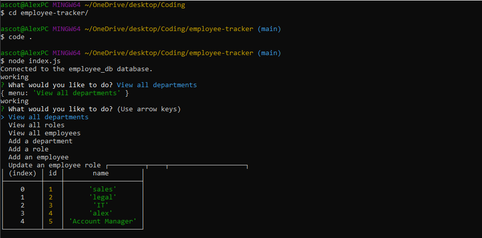

# employee-tracker

## Name

Employee Tracker

## Description

Employee Tracker allows users to browse through an employee database using SQL and search various needs, such as:
- View all departments
- View all roles
- View all employees
- Add a department
- Add a role
- Add an employee
- Update an employee role

## Visuals

## Technology/Framework used

- JavaScript
- SQL
- Node

## Installation

- npm i
- node index.js

## Contributor

* Alex Scott

## Questions

github.com/alexhscott
alexhscott@gmail.com